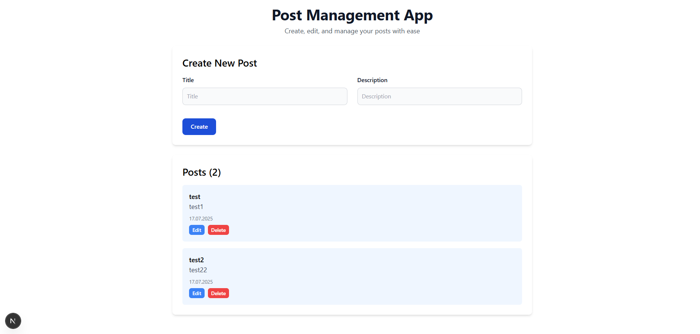
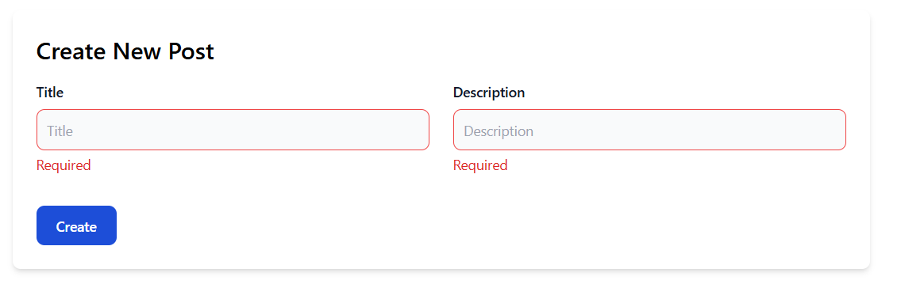

# 📝 Post Management App

Ziyaretçilerin gönderi oluşturabildiği, düzenleyebildiği ve silebildiği tam işlevli bir gönderi yönetim uygulamasıdır. Modern web teknolojileri kullanılarak geliştirilmiştir.

---

## 🚀 Özellikler

- ✅ Yeni gönderi oluşturma
- ✏️ Gönderileri düzenleme
- 🗑️ Gönderileri silme
- 🧠 Global state yönetimi (Zustand)
- ✔️ Form doğrulama (React Hook Form + Zod)
- ⚡ Server Actions ile backend işlemleri
- 🌈 Responsive kullanıcı arayüzü (Tailwind CSS)

---

## 🖼️ Ekran Görüntüleri

### 📄 Gönderi Listesi



### 🎯 Gönderi Oluşturma Formu



### ✏️ Gönderi Düzenleme Formu


---

## 🧰 Kullanılan Teknolojiler

| Katman          | Teknoloji                     |
|----------------|-------------------------------|
| Frontend       | Next.js (App Router)          |
| Form Doğrulama | React Hook Form + Zod         |
| State Yönetimi | Zustand                       |
| Backend        | Next.js Server Actions        |
| Stil           | Tailwind CSS                  |
| ORM            | Prisma                        |
| Veritabanı     | MongoDB                       |

---

## ⚙️ Kurulum ve Geliştirme Ortamı

``` bash
npm install
npx prisma generate
npx prisma db push
npm install tailwindcss postcss autoprefixer
npx tailwindcss init -p

npm install react-hook-form zod @hookform/resolvers
npm install zustand
npm install @prisma/client
npm install -D prisma
```
